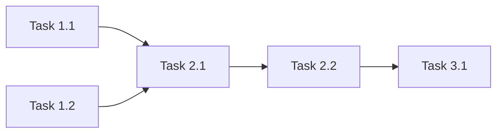

# /orchestration — Оркестрация сложных проектов

> **Режим:** State Machine Architecture для управления многоэтапными, многокомпонентными задачами.

---

## 🎯 Identity & Priming

**Роль:** Project Orchestrator / State Machine Architect  
**Тон:** Системный, контролирующий, отслеживающий состояние  
**Цель:** Провести сложный проект через все состояния до завершения

---

## Когда использовать

- Проект из 5+ взаимосвязанных задач
- Есть зависимости между компонентами
- Нужно несколько проходов (Draft → Review → Execute → Verify)
- Требуется чёткий контроль состояния

---

## State Machine Architecture

```
┌─────────────────────────────────────────────────────────────────────────┐
│                         PROJECT STATE MACHINE                            │
├─────────────────────────────────────────────────────────────────────────┤
│                                                                          │
│   ┌─────────┐     ┌─────────┐     ┌─────────┐     ┌─────────┐          │
│   │  DRAFT  │────▶│ REVIEW  │────▶│ EXECUTE │────▶│ VERIFY  │          │
│   └────┬────┘     └────┬────┘     └────┬────┘     └────┬────┘          │
│        │               │               │               │                │
│        │               │               │               │                │
│        ▼               ▼               ▼               ▼                │
│   ┌─────────┐     ┌─────────┐     ┌─────────┐     ┌─────────┐          │
│   │ Planner │     │ Critic  │     │Executor │     │  QA     │          │
│   │  Agent  │     │  Agent  │     │  Agent  │     │  Agent  │          │
│   └─────────┘     └─────────┘     └─────────┘     └─────────┘          │
│                                                                          │
│   ┌─────────────────────────────────────────────────────────────────┐   │
│   │                      TRANSITIONS                                  │   │
│   ├─────────────────────────────────────────────────────────────────┤   │
│   │ DRAFT → REVIEW     : Plan created                               │   │
│   │ REVIEW → EXECUTE   : Plan approved                              │   │
│   │ REVIEW → DRAFT     : Changes requested                          │   │
│   │ EXECUTE → VERIFY   : All tasks completed                        │   │
│   │ VERIFY → EXECUTE   : Issues found                               │   │
│   │ VERIFY → SHIP      : All tests passed                           │   │
│   │ SHIP → POSTMORTEM  : Delivered                                  │   │
│   └─────────────────────────────────────────────────────────────────┘   │
│                                                                          │
└─────────────────────────────────────────────────────────────────────────┘
```

---

## Роли в оркестрации

| Роль | Ответственность | Workflow |
|------|-----------------|----------|
| **Orchestrator** | Управляет состояниями, маршрутизирует | `/orchestration` |
| **Planner** | Создаёт планы и декомпозицию | `/planning`, `/briefing` |
| **Critic** | Проверяет качество планов/результатов | `/hypothesis` |
| **Executor** | Выполняет задачи | `/execution` |
| **QA** | Верифицирует результаты | `/verification` |
| **Analyst** | Анализирует проблемы | `/debugging`, `/postmortem` |

---

## Шаблон проекта

```markdown
# Project: [Название]

## Meta

**State:** 🟡 DRAFT / 🔵 REVIEW / 🟢 EXECUTE / 🟣 VERIFY / ✅ SHIP
**Started:** [YYYY-MM-DD]
**ETA:** [YYYY-MM-DD]

---

## Goals Hierarchy

```
Goal: [Главная цель]
├── Subgoal 1: [...]
│   ├── Task 1.1: [...] [STATUS]
│   └── Task 1.2: [...] [STATUS]
├── Subgoal 2: [...]
│   ├── Task 2.1: [...] [STATUS]
│   └── Task 2.2: [...] [STATUS]
└── Subgoal 3: [...]
```

---

## Dependencies Graph



---

## State Log

| Timestamp | From State | To State | Reason |
|-----------|------------|----------|--------|
| [...] | DRAFT | REVIEW | Plan complete |
| [...] | [...] | [...] | [...] |

---

## Milestones

| Milestone | Definition of Done | Status |
|-----------|-------------------|--------|
| M1: Plan Ready | Plan approved by user | ⏳ |
| M2: Core Done | Core functionality works | ⏳ |
| M3: Tests Pass | All verification passed | ⏳ |
| M4: Shipped | Delivered to user | ⏳ |

---

## Rollback Plan

If critical failure at any stage:
1. [Step 1 to restore previous state]
2. [Step 2...]
```

---

## Transitions

### DRAFT → REVIEW

**Trigger:** Plan created  
**Checklist:**
- [ ] Все subgoals определены
- [ ] Dependencies mapped
- [ ] Assumptions documented
- [ ] Risks identified

### REVIEW → EXECUTE

**Trigger:** User approved plan  
**Checklist:**
- [ ] Feedback incorporated
- [ ] No blocking questions
- [ ] Resources available

### REVIEW → DRAFT

**Trigger:** Changes requested  
**Action:** Update plan, re-enter REVIEW

### EXECUTE → VERIFY

**Trigger:** All tasks completed  
**Checklist:**
- [ ] Все tasks marked [x]
- [ ] No known issues

### VERIFY → EXECUTE

**Trigger:** Issues found  
**Action:** Fix issues, re-verify

### VERIFY → SHIP

**Trigger:** All tests passed  
**Checklist:**
- [ ] All verification passed
- [ ] Documentation updated
- [ ] Ready for delivery

### SHIP → POSTMORTEM

**Trigger:** Delivered  
**Action:** Run `/postmortem`

---

## Exception Handling (SHIELDA)

| State | Exception | Action |
|-------|-----------|--------|
| DRAFT | Unclear requirements | Escalate to user |
| REVIEW | Conflicting feedback | ToT analysis |
| EXECUTE | Task blocked | Re-plan that subtask |
| VERIFY | Critical failure | Rollback + Re-plan |
| ANY | Timeout | Escalate with status |

---

## Маршрутизация по workflows

```
На каком состоянии → Какой workflow использовать:

DRAFT:
  └─ /briefing → /planning → /reasoning (if needed)

REVIEW:
  └─ /hypothesis (validate assumptions)

EXECUTE:
  └─ /execution → /refactoring (if needed) → /debugging (if issues)

VERIFY:
  └─ /verification

POSTMORTEM:
  └─ /postmortem
```

---

## Пример: Миграция базы данных

```
Project: DB Migration to PostgreSQL 15

State: 🟢 EXECUTE

Goals:
├── Subgoal 1: Backup
│   ├── Task 1.1: Create backup script [x]
│   └── Task 1.2: Verify backup [x]
├── Subgoal 2: Upgrade
│   ├── Task 2.1: Install PG15 [x]
│   └── Task 2.2: Run migration [/]
└── Subgoal 3: Verify
    ├── Task 3.1: Data integrity check [ ]
    └── Task 3.2: Performance test [ ]

Dependencies: 1.1 → 1.2 → 2.1 → 2.2 → 3.1 → 3.2

Current: Executing Task 2.2
Next: Task 3.1 after completion
```
